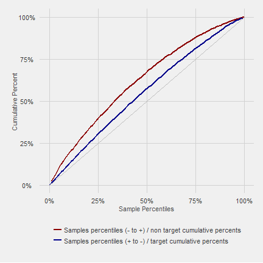
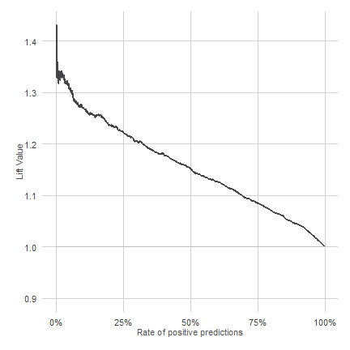
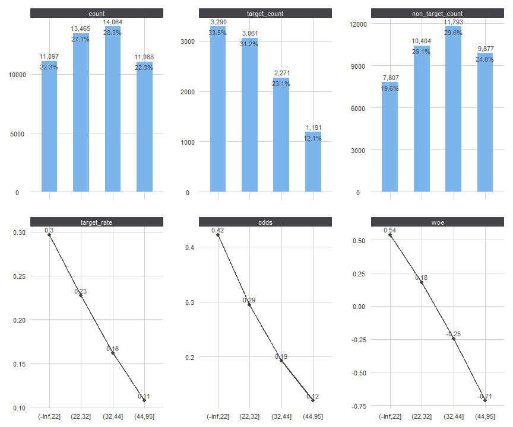
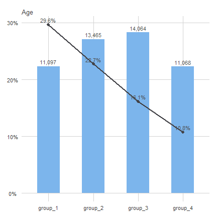

# riskr
<!-- README.md is generated from README.Rmd -->

<!--
<a href="https://github.com/jbkunst/riskr"></a>

<style>
  table, .table {
    width: 90%;
    margin-left: auto;
    margin-right: auto;
    font-size: 0.8em;
  }
</style>
--> 


[](https://travis-ci.org/jbkunst/riskr)
[](http://www.r-pkg.org/pkg/riskr)
[](http://www.r-pkg.org/pkg/riskr)

## Introduction

The `riskr` package facilitate *credit scoring* tasks such as measure the scores/models performance and make easy the scoring modelling process.

There are function to:

 1. Measure in a simple way the performance of models via wrappers/shortcuts from ROCR functions.
 2. Visualize relationships between variables.
 4. Compute usual values in the credit scoring PSI, WOE, IV, KS, AUCROC, among others.
 5. Make easier the modelling and validation process. 

## Assumptions

`riskr` assume the target variable is *binary* with numeric values: 0 and 1. Usually 1 means the characteristic of interest.

## Installation

You can install the latest development version from github with:


```r
devtools::install_github("jbkunst/riskr")
```

## Functions

### Performance Indicators & Plots

Usually we have a data frame with a *target* variable and a *score* (or probability) like this:


```r
library("riskr")

data("predictions")

head(predictions)
```


| score| target|
|-----:|------:|
| 0.202|      1|
| 0.806|      1|
| 0.513|      1|
| 0.052|      0|
| 0.329|      1|
| 0.246|      0|

```r

score <- predictions$score

target <- predictions$target
```

The main statistics or indicators are KS, AUCROC so:


```r
perf(target, score)
```


|    ks| aucroc|  gini| divergence|
|-----:|------:|-----:|----------:|
| 0.254|  0.676| 0.353|      0.408|

There are functions to calculate every indicator.


```r
aucroc(target, score)
## [1] 0.676
```

There are some functions to plot the score/model performance (based on ggplot package).


```r
gg_perf(target, score)
```


And:


```r
gg_roc(target, score)
```


```r

gg_gain(target, score)
```



```r

gg_lift(target, score)
```



### Tables (Uni/Bivariate) & Plots


```r
data("credit")

ft(credit$marital_status)
```


|class | count| percent|
|:-----|-----:|-------:|
|S     | 25249|   0.508|
|C     | 17097|   0.344|
|O     |  2776|   0.056|
|V     |  2430|   0.049|
|D     |  2142|   0.043|

```r

bt(credit$marital_status, credit$bad)
```


|class | count| percent| target_count| target_rate| target_percent| non_target_count| non_target_percent|  odds|    woe|    iv|
|:-----|-----:|-------:|------------:|-----------:|--------------:|----------------:|------------------:|-----:|------:|-----:|
|C     | 17097|   0.344|         2483|       0.145|          0.253|            14614|              0.366| 0.170| -0.370| 0.042|
|D     |  2142|   0.043|          322|       0.150|          0.033|             1820|              0.046| 0.177| -0.330| 0.004|
|O     |  2776|   0.056|          660|       0.238|          0.067|             2116|              0.053| 0.312|  0.237| 0.003|
|S     | 25249|   0.508|         6059|       0.240|          0.617|            19190|              0.481| 0.316|  0.249| 0.034|
|V     |  2430|   0.049|          289|       0.119|          0.029|             2141|              0.054| 0.135| -0.600| 0.015|

```r

credit$age_bin <- bin_sup(credit$age, credit$bad, min.p = 0.20)$variable_new

bt(credit$age_bin, credit$bad)
```


|class   | count| percent| target_count| target_rate| target_percent| non_target_count| non_target_percent|  odds|    woe|    iv|
|:-------|-----:|-------:|------------:|-----------:|--------------:|----------------:|------------------:|-----:|------:|-----:|
|group_1 | 11097|   0.223|         3290|       0.296|          0.335|             7807|              0.196| 0.421|  0.538| 0.075|
|group_2 | 13465|   0.271|         3061|       0.227|          0.312|            10404|              0.261| 0.294|  0.179| 0.009|
|group_3 | 14064|   0.283|         2271|       0.161|          0.231|            11793|              0.296| 0.193| -0.245| 0.016|
|group_4 | 11068|   0.223|         1191|       0.108|          0.121|             9877|              0.248| 0.121| -0.713| 0.090|


```r
gg_ba(credit$age_bin, credit$bad)
```



The minified version of `gg_ba`

```r
gg_ba2(credit$age_bin, credit$bad) + ggtitle("Age")
```




### Odds Tables

The odds tables are other way to show how a score/model performs.


```r
score <- round(predictions$score * 1000)

odds_table(target, score, nclass = 5) # default is (nclass =) 10 groups of equal size
```


|class     | count| percent| target_count| target_rate| target_percent| non_target_count| non_target_percent| odds|    woe|    iv|
|:---------|-----:|-------:|------------:|-----------:|--------------:|----------------:|------------------:|----:|------:|-----:|
|[1,164]   |  2009|   0.201|         1010|       0.503|          0.144|              999|              0.332| 1.01| -0.832| 0.156|
|(164,331] |  1991|   0.199|         1255|       0.630|          0.180|              736|              0.245| 1.71| -0.309| 0.020|
|(331,526] |  2008|   0.201|         1429|       0.712|          0.204|              579|              0.192| 2.47|  0.061| 0.001|
|(526,738] |  2000|   0.200|         1573|       0.786|          0.225|              427|              0.142| 3.68|  0.461| 0.038|
|(738,996] |  1992|   0.199|         1723|       0.865|          0.246|              269|              0.089| 6.41|  1.015| 0.159|

### Ranking Predictive Variables


```r
ranks <- pred_ranking(credit, "bad")
head(ranks)
```


|variable            |    ks| aucroc|
|:-------------------|-----:|------:|
|age                 | 0.191|  0.626|
|age_bin             | 0.191|  0.619|
|marital_status      | 0.150|  0.577|
|months_in_the_job   | 0.129|  0.567|
|flag_res_phone      | 0.112|  0.556|
|area_code_res_phone | 0.078|  0.547|

### Confusion Matrix

The `conf_matrix` function return a list with the next elements:


```r
target_pred <- ifelse(score < 500, 0, 1)

cm <- conf_matrix(target_pred, target)
```

- The confusion matrix:

```r
cm$confusion.matrix
```


|   |class  | pred 0| pred 1|
|:--|:------|------:|------:|
|0  |true 0 |   2230|    780|
|1  |true 1 |   3476|   3514|

- The confusion matrix statistics

```r
cm$indicators
```


|term                        |term.short | value|
|:---------------------------|:----------|-----:|
|Accuracy                    |AC         | 0.574|
|True Positive rate (Recall) |Recall     | 0.503|
|False Positive rate         |FP         | 0.259|
|True Negative rate          |TN         | 0.741|
|False Negative rate         |FN         | 0.497|
|Precision                   |P          | 0.818|

## Related work

1. [woe](http://github.com/tomasgreif/woe) package by [tomasgreif](http://github.com/tomasgreif)
1. [smbinning](http://cran.r-project.org/web/packages/smbinning) package by [Herman Jopia](http://github.com/hjopia). [Github repository](https://github.com/cran/smbinning).
1. [Guide to Credit Scoring in R](https://cran.r-project.org/doc/contrib/Sharma-CreditScoring.pdf)
1. [Gains package](https://cran.r-project.org/web/packages/gains/gains.pdf)
1. [plotROC package](https://github.com/sachsmc/plotROC) by [Michael Sachs](https://github.com/sachsmc/)

## Session Info

```r
library("riskr")
library("printr") # remove this for vignette
library("ggplot2")
library("ggthemes")
options(digits = 3, knitr.table.format = "markdown")
knitr::opts_chunk$set(collapse = TRUE, warning = FALSE,
                      fig.path = "vignettes/figures/",
                      fig.width = 6, fig.height = 6,
                      fig.align = "center", dpi = 72)

theme_set(theme_fivethirtyeight(base_size = 11) +
            theme(rect = element_rect(fill = "white"),
                  axis.title = element_text(colour = "grey30"),
                  axis.title.y = element_text(angle = 90),
                  strip.background = element_rect(fill = "#434348"),
                  strip.text = element_text(color = "#F0F0F0"),
                  plot.title = element_text(face = "plain", size = structure(1.2, class = "rel")),
                  panel.margin.x =  grid::unit(1, "cm"),
                  panel.margin.y =  grid::unit(1, "cm")))
update_geom_defaults("line", list(colour = "#434348", size = 1.05))
update_geom_defaults("point", list(colour = "#434348", size = 3))
update_geom_defaults("bar", list(fill = "#7cb5ec"))
update_geom_defaults("text", list(size = 4, colour = "gray30"))
```


```r
print(sessionInfo())
## R version 3.1.3 (2015-03-09)
## Platform: x86_64-w64-mingw32/x64 (64-bit)
## Running under: Windows 8 x64 (build 9200)
## 
## locale:
## [1] LC_COLLATE=Spanish_Chile.1252  LC_CTYPE=Spanish_Chile.1252   
## [3] LC_MONETARY=Spanish_Chile.1252 LC_NUMERIC=C                  
## [5] LC_TIME=Spanish_Chile.1252    
## 
## attached base packages:
## [1] stats     graphics  grDevices utils     datasets  methods   base     
## 
## other attached packages:
## [1] ggthemes_2.2.1 ggplot2_1.0.1  printr_0.0.4   riskr_1.0     
## 
## loaded via a namespace (and not attached):
##  [1] assertthat_0.1     bitops_1.0-6       caTools_1.17.1    
##  [4] colorspace_1.2-6   DBI_0.3.1          digest_0.6.8      
##  [7] dplyr_0.4.2        evaluate_0.7       formatR_1.2       
## [10] Formula_1.2-1      gdata_2.17.0       gplots_2.17.0     
## [13] grid_3.1.3         gtable_0.1.2       gtools_3.4.2      
## [16] highr_0.5          htmltools_0.2.6    KernSmooth_2.23-14
## [19] knitr_1.10.5       labeling_0.3       lazyeval_0.1.10   
## [22] magrittr_1.5       MASS_7.3-39        munsell_0.4.2     
## [25] parallel_3.1.3     partykit_1.0-2     plyr_1.8.3        
## [28] proto_0.3-10       R6_2.1.0           Rcpp_0.12.0       
## [31] reshape2_1.4.1     rmarkdown_0.7.1    ROCR_1.0-7        
## [34] scales_0.2.5       splines_3.1.3      stringi_0.5-5     
## [37] stringr_1.0.0      survival_2.38-1    tidyr_0.2.0       
## [40] tools_3.1.3        yaml_2.1.13
```
