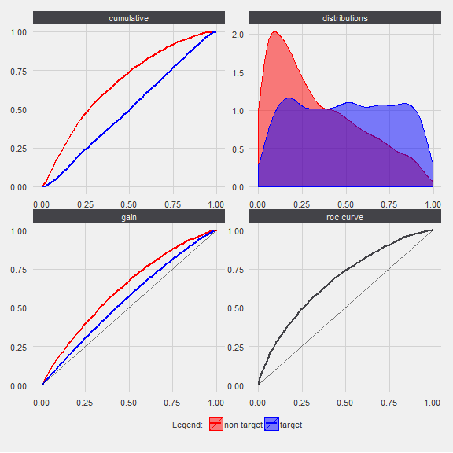
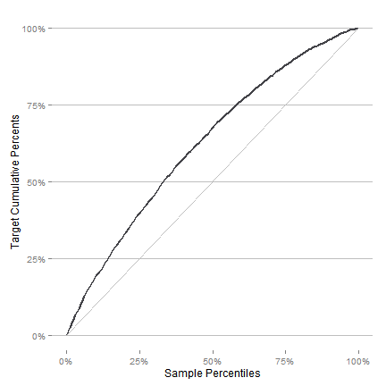
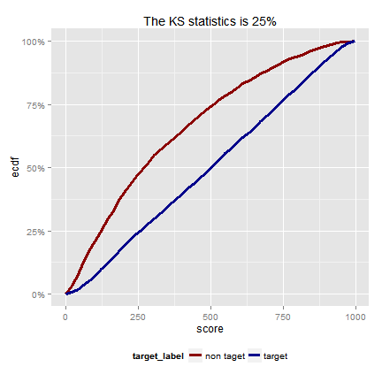
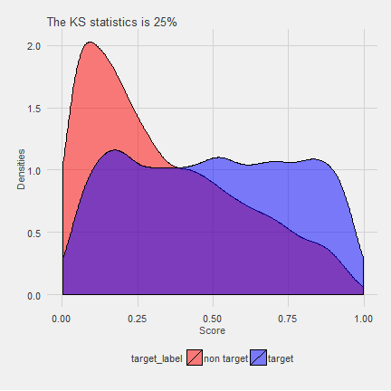
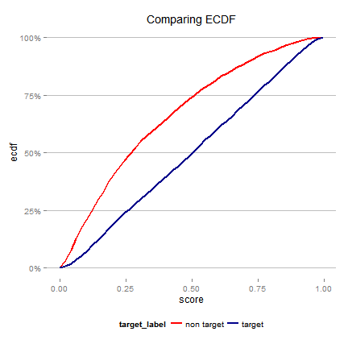
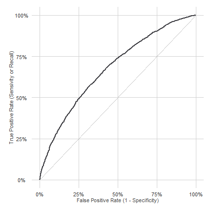
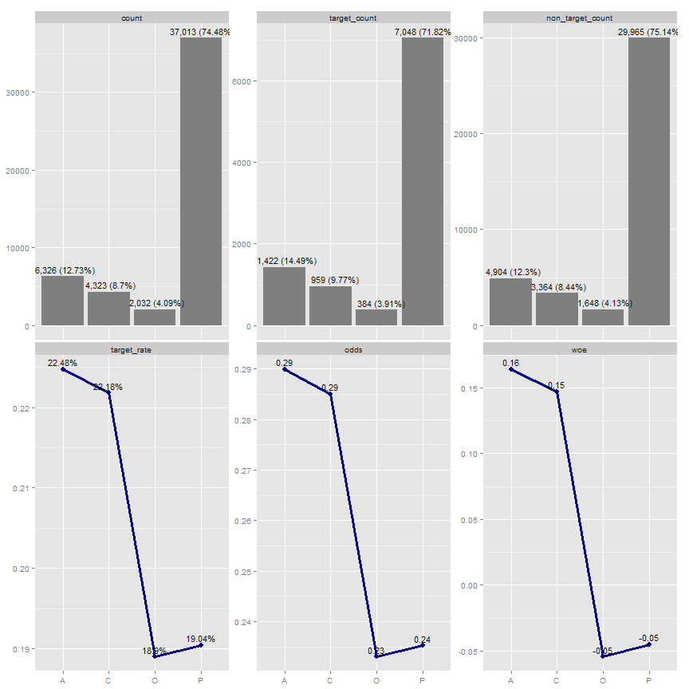
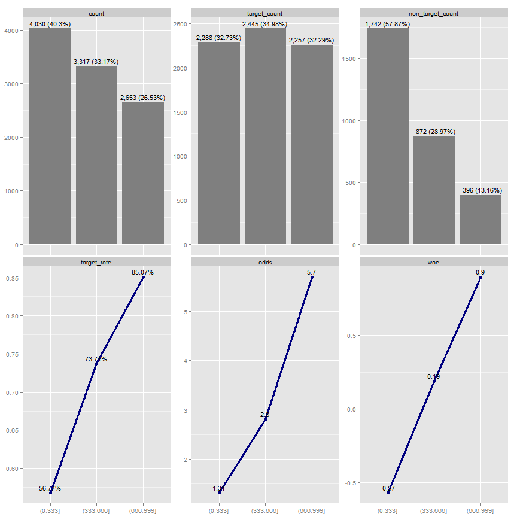
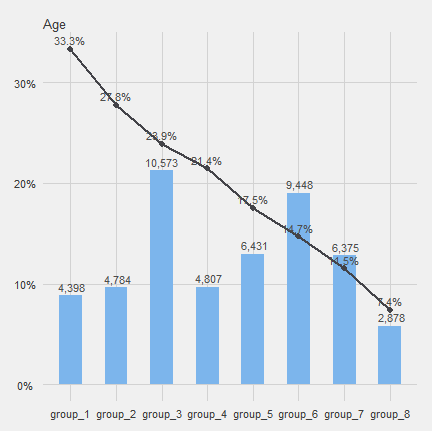
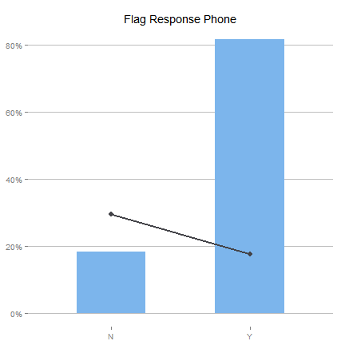

# riskr
<!-- README.md is generated from README.Rmd -->


## Introduction

The `riskr` package facilitate *credit scoring* tasks such as measure the scores/models performance and make easy the scoring modelling process.

There are function to:

 1. Measure in a simple way the performance of models via wrappers/shortcuts from ROCR functions.
 2. Visualize relationships between variables.
 4. Compute usual values in the credit scoring PSI, WOE, IV, KS, AUCROC, among others.
 5. Make easier the modelling and validation process. 

## Assumptions

`riskr` assume the target variable is *binary* with numeric values: 0 and 1. Usually 1 means the characteristic of interest.

## Installation

You can install the latest development version from github with:


```r
devtools::install_github("jbkunst/riskr")
```

## Functions

Usually we have a data frame with a *target* variable and a *score* (or probability) like this:


```r
library("riskr")

data("predictions")

head(predictions)
```


| score| target|
|-----:|------:|
| 0.202|      1|
| 0.806|      1|
| 0.513|      1|
| 0.052|      0|
| 0.329|      1|
| 0.246|      0|

```r

str(predictions)
> 'data.frame':	10000 obs. of  2 variables:
>  $ score : num  0.2023 0.8058 0.5134 0.0525 0.3288 ...
>  $ target: num  1 1 1 0 1 0 1 0 1 1 ...

score <- predictions$score

target <- predictions$target
```

### Performance Indicators

The main statistics or indicators are KS, AUCROC so:


```r
ks(score, target)
> [1] 0.254

aucroc(score, target)
> [1] 0.676

gini(score, target)
> [1] 0.353

perf(score, target)
```


| count| target_count| target_rate|    ks| aucroc|  gini|
|-----:|------------:|-----------:|-----:|------:|-----:|
| 10000|         6990|       0.699| 0.254|  0.676| 0.353|

There are some functions to plot the score/model performance (based on ggplot package).


```r
plot_roc(score, target)
```



```r

plot_gain(score, target)
```



```r

plot_lift(score, target)
```



```r

plot_dists(score, target) +
  ggtitle(sprintf("The KS statistics is %.0f%%", 100 * ks(score, target)))
```



```r

plot_ks(score, target) + ggtitle("Comparing ECDF")
```




```r
plot_perf(score, target)
```



### Odds Tables

The odds tables are other way to show how a score/model performs.


```r
score <- round(predictions$score * 1000)

odds_table(score, target, nclass = 5) # default is (nclass =) 10 groups of equal size
```


|class     | count| percent| target_count| target_rate| target_percent| non_target_count| non_target_percent| odds|    woe|    iv|
|:---------|-----:|-------:|------------:|-----------:|--------------:|----------------:|------------------:|----:|------:|-----:|
|[1,164]   |  2009|   0.201|         1010|       0.503|          0.144|              999|              0.332| 1.01| -0.832| 0.156|
|(164,331] |  1991|   0.199|         1255|       0.630|          0.180|              736|              0.245| 1.71| -0.309| 0.020|
|(331,526] |  2008|   0.201|         1429|       0.712|          0.204|              579|              0.192| 2.47|  0.061| 0.001|
|(526,738] |  2000|   0.200|         1573|       0.786|          0.225|              427|              0.142| 3.68|  0.461| 0.038|
|(738,996] |  1992|   0.199|         1723|       0.865|          0.246|              269|              0.089| 6.41|  1.015| 0.159|

```r

odds_table(score, target, breaks = c(0, 300, 700, 999))
```


|class     | count| percent| target_count| target_rate| target_percent| non_target_count| non_target_percent| odds|    woe|    iv|
|:---------|-----:|-------:|------------:|-----------:|--------------:|----------------:|------------------:|----:|------:|-----:|
|(0,300]   |  3675|   0.368|         2052|       0.558|          0.294|             1623|              0.539| 1.26| -0.608| 0.149|
|(300,700] |  3978|   0.398|         2926|       0.736|          0.419|             1052|              0.350| 2.78|  0.180| 0.012|
|(700,999] |  2347|   0.235|         2012|       0.857|          0.288|              335|              0.111| 6.01|  0.950| 0.168|

### Confusion Matrix

The `conf_matrix` function return a list with the next elements:


```r
score_cat <- ifelse(score < 500, 0, 1)

cm <- conf_matrix(score_cat, target)
```

- The confusion matrix:

```r
cm$confusion.matrix
```


|   |class  | pred 0| pred 1|
|:--|:------|------:|------:|
|0  |true 0 |   2230|    780|
|1  |true 1 |   3476|   3514|

- The confusion matrix statistics

```r
cm$indicators
```


|term                                  |term.short | value|
|:-------------------------------------|:----------|-----:|
|Accuracy                              |AC         | 0.574|
|Recall &#124; True Positive rate (GG) |Recall     | 0.503|
|False Positive rate                   |FP         | 0.259|
|True Negative rate (BB)               |TN         | 0.741|
|False Negative rate                   |FN         | 0.497|
|Precision                             |P          | 0.818|

```r

cm$indicators.t
```


|    AC| Recall|    FP|    TN|    FN|     P|
|-----:|------:|-----:|-----:|-----:|-----:|
| 0.574|  0.503| 0.259| 0.741| 0.497| 0.818|


### Bivariate Tables


```r
data("credit")

str(credit)
> 'data.frame':	49694 obs. of  17 variables:
>  $ id_client          : int  1 7 9 12 14 19 22 26 28 30 ...
>  $ sex                : chr  "F" "F" "F" "F" ...
>  $ marital_status     : chr  "O" "S" "S" "C" ...
>  $ age                : int  44 22 27 32 36 46 17 20 71 46 ...
>  $ flag_res_phone     : chr  "N" "Y" "Y" "Y" ...
>  $ area_code_res_phone: int  31 31 31 31 31 50 50 50 31 31 ...
>  $ payment_day        : int  12 12 20 12 12 12 12 12 18 8 ...
>  $ residence_type     : chr  "P" "A" "A" "P" ...
>  $ months_in_residence: int  12 0 0 24 120 360 12 12 96 72 ...
>  $ months_in_the_job  : int  48 48 0 0 36 120 12 24 12 12 ...
>  $ profession_code    : int  731 999 950 165 15 704 38 39 13 801 ...
>  $ flag_other_card    : chr  "N" "N" "N" "N" ...
>  $ flag_mobile_phone  : chr  "N" "N" "N" "N" ...
>  $ flag_contact_phone : chr  "N" "N" "N" "N" ...
>  $ personal_net_income: num  300 410 1000 700 1987 ...
>  $ quant_add_cards    : int  0 0 0 0 1 0 0 0 0 0 ...
>  $ bad                : int  0 0 1 0 0 0 1 1 0 0 ...

ft(credit$marital_status)
```


|class | count| percent|
|:-----|-----:|-------:|
|S     | 25249|   0.508|
|C     | 17097|   0.344|
|O     |  2776|   0.056|
|V     |  2430|   0.049|
|D     |  2142|   0.043|

```r

bt(credit$marital_status, credit$bad)
```


|class | count| percent| target_count| target_rate| target_percent| non_target_count| non_target_percent|  odds|    woe|    iv|
|:-----|-----:|-------:|------------:|-----------:|--------------:|----------------:|------------------:|-----:|------:|-----:|
|C     | 17097|   0.344|         2483|       0.145|          0.253|            14614|              0.366| 0.170| -0.370| 0.042|
|D     |  2142|   0.043|          322|       0.150|          0.033|             1820|              0.046| 0.177| -0.330| 0.004|
|O     |  2776|   0.056|          660|       0.238|          0.067|             2116|              0.053| 0.312|  0.237| 0.003|
|S     | 25249|   0.508|         6059|       0.240|          0.617|            19190|              0.481| 0.316|  0.249| 0.034|
|V     |  2430|   0.049|          289|       0.119|          0.029|             2141|              0.054| 0.135| -0.600| 0.015|

```r

library("ggplot2")

credit$age_bin <- cut_interval(credit$age, 3)

bt(credit$age_bin, credit$bad)
```


|class       | count| percent| target_count| target_rate| target_percent| non_target_count| non_target_percent|  odds|    woe|    iv|
|:-----------|-----:|-------:|------------:|-----------:|--------------:|----------------:|------------------:|-----:|------:|-----:|
|[15,41.7]   | 35654|   0.717|         8174|       0.229|          0.833|            27480|              0.689| 0.297|  0.190| 0.027|
|(41.7,68.3] | 13313|   0.268|         1585|       0.119|          0.162|            11728|              0.294| 0.135| -0.599| 0.079|
|(68.3,95]   |   727|   0.015|           54|       0.074|          0.006|              673|              0.017| 0.080| -1.121| 0.013|


```r
plot_ba(credit$age_bin, credit$bad)
```



```r

# order by odds
lvls_rt <- bt(credit$residence_type, credit$bad) %>% 
  arrange(desc(odds)) %>%  .[["class"]]

residence_type2 <- factor(credit$residence_type, levels = lvls_rt)

plot_ba(residence_type2, credit$bad)
```



The minified version of `plot_ba`

```r
plot_ba2(credit$age_bin, credit$bad) + ggtitle("Age")
```



```r


plot_ba2(credit$flag_res_phone, credit$bad, labels = FALSE) +
  ggtitle("Flag Response Phone")
```



## Related work

1. [woe](http://github.com/tomasgreif/woe) package by [tomasgreif](http://github.com/tomasgreif)
1. [smbinning](http://cran.r-project.org/web/packages/smbinning) package by [Herman Jopia](http://github.com/hjopia). [Github repository](https://github.com/cran/smbinning).
1. [Guide to Credit Scoring in R](https://cran.r-project.org/doc/contrib/Sharma-CreditScoring.pdf)
1. [Gains package](https://cran.r-project.org/web/packages/gains/gains.pdf)
