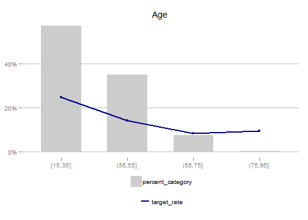
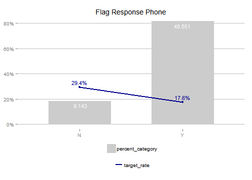

# riskr
<!-- README.md is generated from README.Rmd -->


## Introduction

First Header  | Second Header
------------- | -------------
Content Cell  | Content Cell
Content Cell  | Content Cell

asda


 score   target
------  -------
 0.202        1
 0.806        1

The `riskr` package facilitate repetitive *bussines risk* [^](or other areas) tasks. In general this package helps to:

 1. Measure in a easy way the performance of models via wrapper or shortcuts from ROCR functions.
 2. Visualize relationships between variables.
 3. Facilitate the usual and repetitives tasks.

## Installation

You can install the latest development version from github with:


```r
devtools::install_github("jbkunst/riskr")
```

## Facts

`riskr` assume the target variable is binary with numeric values: 0 and 1. Usually 1 means the characteristic of interest.

## Functions

Usually we have a data frame with a *target* variable and a *score* (or probability) like this:


```r
library("riskr")

data("predictions")

head(predictions)
```


 score   target
------  -------
 0.202        1
 0.806        1
 0.513        1
 0.052        0
 0.329        1
 0.246        0

```r

str(predictions)
#> 'data.frame':	10000 obs. of  2 variables:
#>  $ score : num  0.2023 0.8058 0.5134 0.0525 0.3288 ...
#>  $ target: num  1 1 1 0 1 0 1 0 1 1 ...

score <- predictions$score

target <- predictions$target
```

### Performance Indicators

The main statistics or indicators are KS, AUCROC so:


```r
ks(score, target)
#> [1] 0.254

aucroc(score, target)
#> [1] 0.676

gini(score, target)
#> [1] 0.353

score_indicators(score, target)
```


 count   target_count   target_rate      ks   aucroc    gini
------  -------------  ------------  ------  -------  ------
 10000           6990         0.699   0.254    0.676   0.353

```r

plot_roc(score, target)
#> Warning: package 'scales' was built under R version 3.2.1
```


```r

plot_gain(score, target)
```


### Odds Table

The odds table are other way to show how a score/model performs.


```r
score <- round(predictions$score * 1000)

odds_table(score, target, nclass = 4)
```


variable     count   percent   target_count   target_rate   target_percent   odds
----------  ------  --------  -------------  ------------  ---------------  -----
[1,199]       2502     0.250           1304         0.521            0.187   1.09
(199,430]     2504     0.250           1661         0.663            0.238   1.97
(430,683]     2502     0.250           1894         0.757            0.271   3.12
(683,996]     2492     0.249           2131         0.855            0.305   5.90

```r

odds_table(score, target, breaks = c(0, 300, 700, 999))
```


variable     count   percent   target_count   target_rate   target_percent   odds
----------  ------  --------  -------------  ------------  ---------------  -----
(0,300]       3675     0.368           2052         0.558            0.294   1.26
(300,700]     3978     0.398           2926         0.736            0.419   2.78
(700,999]     2347     0.235           2012         0.857            0.288   6.01

### Confusion Matrix


```r
score_cat <- ifelse(score < 500, 0, 1)

conf_matrix(score_cat, target)
#> $confusion.matrix
#>    class pred 0 pred 1
#> 0 true 0   2230    780
#> 1 true 1   3476   3514
#> 
#> $indicators
#>                               term term.short value
#> 1                         Accuracy         AC 0.574
#> 2 Recall | True Positive rate (GG)     Recall 0.503
#> 3              False Positive rate         FP 0.259
#> 4          True Negative rate (BB)         TN 0.741
#> 5              False Negative rate         FN 0.497
#> 6                        Precision          P 0.818
#> 
#> $indicators.t
#>      AC Recall    FP    TN    FN     P
#> 1 0.574  0.503 0.259 0.741 0.497 0.818
```

### Bivariate Tables


```r
data("credit")

str(credit)
#> 'data.frame':	49694 obs. of  17 variables:
#>  $ id_client          : int  1 7 9 12 14 19 22 26 28 30 ...
#>  $ sex                : chr  "F" "F" "F" "F" ...
#>  $ marital_status     : chr  "O" "S" "S" "C" ...
#>  $ age                : int  44 22 27 32 36 46 17 20 71 46 ...
#>  $ flag_res_phone     : chr  "N" "Y" "Y" "Y" ...
#>  $ area_code_res_phone: int  31 31 31 31 31 50 50 50 31 31 ...
#>  $ payment_day        : int  12 12 20 12 12 12 12 12 18 8 ...
#>  $ residence_type     : chr  "P" "A" "A" "P" ...
#>  $ months_in_residence: int  12 0 0 24 120 360 12 12 96 72 ...
#>  $ months_in_the_job  : int  48 48 0 0 36 120 12 24 12 12 ...
#>  $ profession_code    : int  731 999 950 165 15 704 38 39 13 801 ...
#>  $ flag_other_card    : chr  "N" "N" "N" "N" ...
#>  $ flag_mobile_phone  : chr  "N" "N" "N" "N" ...
#>  $ flag_contact_phone : chr  "N" "N" "N" "N" ...
#>  $ personal_net_income: num  300 410 1000 700 1987 ...
#>  $ quant_add_cards    : int  0 0 0 0 1 0 0 0 0 0 ...
#>  $ bad                : int  0 0 1 0 0 0 1 1 0 0 ...

ft(credit$marital_status)
```


class    count   percent
------  ------  --------
C        17097     0.344
D         2142     0.043
O         2776     0.056
S        25249     0.508
V         2430     0.049

```r

bt(credit$marital_status, credit$bad)
```


variable    count   percent   target_count   target_rate   target_percent    odds
---------  ------  --------  -------------  ------------  ---------------  ------
C           17097     0.344           2483         0.145            0.253   0.170
D            2142     0.043            322         0.150            0.033   0.177
O            2776     0.056            660         0.238            0.067   0.312
S           25249     0.508           6059         0.240            0.617   0.316
V            2430     0.049            289         0.119            0.029   0.135

```r

library("ggplot2")

credit$age_bin <- cut_interval(credit$age, 4)

bt(credit$age_bin, credit$bad)
```


variable    count   percent   target_count   target_rate   target_percent    odds
---------  ------  --------  -------------  ------------  ---------------  ------
[15,35]     28377     0.571           7015         0.247            0.715   0.328
(35,55]     17425     0.351           2473         0.142            0.252   0.165
(55,75]      3767     0.076            313         0.083            0.032   0.091
(75,95]       125     0.003             12         0.096            0.001   0.106

```r

plot_bt(credit$age_bin, credit$bad) + ggtitle("Age")
```



```r

plot_bt(credit$flag_res_phone, credit$bad,
        count.labels = TRUE, target.labels = TRUE) +
  ggtitle("Flag Response Phone")
```




