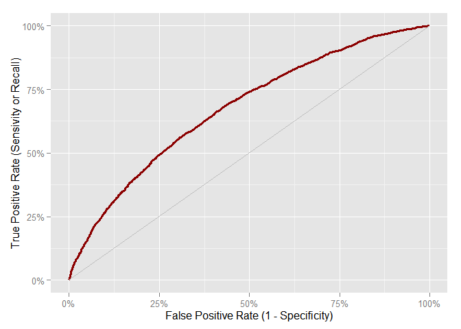
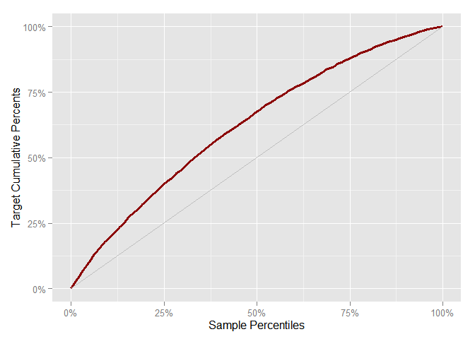
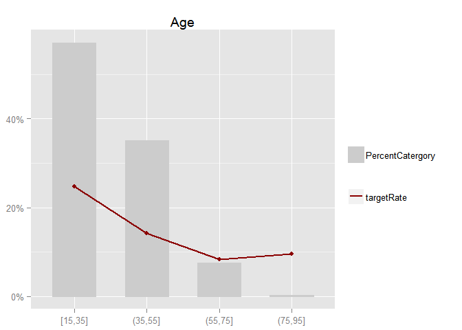
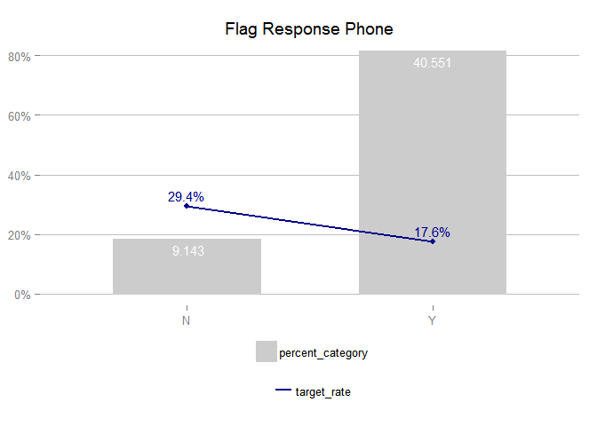

# Riskr
<!-- README.md is generated from README.Rmd. Please edit that file -->


# Introduction

The `riskr` package helps to validate performance of models via wrapper or shortcuts from ROCR functions. 

# Installation

You can install the latest development version from github with:


```r
devtools::install_github("jbkunst/riskr")
```

# Facts

`riskr` assume the target variable is binary with numeric values: 0 and 1. Usually 1 means the characteristic of interest.

# Functions

## Performance Indicators


```r
library("riskr")

data("predictions")

head(predictions)
#>        score target
#> 1 0.20233023      1
#> 2 0.80582411      1
#> 3 0.51343757      1
#> 4 0.05247266      0
#> 5 0.32882210      1
#> 6 0.24568500      0

str(predictions)
#> 'data.frame':	10000 obs. of  2 variables:
#>  $ score : num  0.2023 0.8058 0.5134 0.0525 0.3288 ...
#>  $ target: num  1 1 1 0 1 0 1 0 1 1 ...

score <- predictions$score

target <- predictions$target

ks(score, target)
#> [1] 0.2544475

aucroc(score, target)
#> [1] 0.676466

gini(score, target)
#> [1] 0.3529319

score_indicators(score, target)
#>   count target_count target_rate        ks   aucroc      gini
#> 1 10000         6990       0.699 0.2544475 0.676466 0.3529319

plot_roc(score, target)
```

 

```r

plot_gain(score, target)
```

 

```r

score <- round(predictions$score * 1000)

odds_table(score, target, nclass = 4)
#> 
#> Attaching package: 'dplyr'
#> 
#> The following object is masked from 'package:stats':
#> 
#>     filter
#> 
#> The following objects are masked from 'package:base':
#> 
#>     intersect, setdiff, setequal, union
#> Source: local data frame [4 x 7]
#> 
#>    variable count percent target_count target_rate target_percent     odds
#> 1   [1,199]  2502  0.2502         1304   0.5211831      0.1865522 1.088481
#> 2 (199,430]  2504  0.2504         1661   0.6633387      0.2376252 1.970344
#> 3 (430,683]  2502  0.2502         1894   0.7569944      0.2709585 3.115132
#> 4 (683,996]  2492  0.2492         2131   0.8551364      0.3048641 5.903047

odds_table(score, target, breaks = c(0, 300, 700, 1000))
#> Source: local data frame [3 x 7]
#> 
#>      variable count percent target_count target_rate target_percent
#> 1     (0,300]  3675  0.3675         2052   0.5583673      0.2935622
#> 2   (300,700]  3978  0.3978         2926   0.7355455      0.4185980
#> 3 (700,1e+03]  2347  0.2347         2012   0.8572646      0.2878398
#> Variables not shown: odds (dbl)


score_cat <- ifelse(score < 500, 0, 1)

conf_matrix(score_cat, target)
#> $confusion.matrix
#>    class pred 0 pred 1
#> 0 true 0   2230    780
#> 1 true 1   3476   3514
#> 
#> $indicators
#>                               term term.short     value
#> 1                         Accuracy         AC 0.5744000
#> 2 Recall | True Positive rate (GG)     Recall 0.5027182
#> 3              False Positive rate         FP 0.2591362
#> 4          True Negative rate (BB)         TN 0.7408638
#> 5              False Negative rate         FN 0.4972818
#> 6                        Precision          P 0.8183512
#> 
#> $indicators.t
#>       AC    Recall        FP        TN        FN         P
#> 1 0.5744 0.5027182 0.2591362 0.7408638 0.4972818 0.8183512

data("credit")

str(credit)
#> 'data.frame':	49694 obs. of  17 variables:
#>  $ id_client          : int  1 7 9 12 14 19 22 26 28 30 ...
#>  $ sex                : chr  "F" "F" "F" "F" ...
#>  $ marital_status     : chr  "O" "S" "S" "C" ...
#>  $ age                : int  44 22 27 32 36 46 17 20 71 46 ...
#>  $ flag_res_phone     : chr  "N" "Y" "Y" "Y" ...
#>  $ area_code_res_phone: int  31 31 31 31 31 50 50 50 31 31 ...
#>  $ payment_day        : int  12 12 20 12 12 12 12 12 18 8 ...
#>  $ residence_type     : chr  "P" "A" "A" "P" ...
#>  $ months_in_residence: int  12 0 0 24 120 360 12 12 96 72 ...
#>  $ months_in_the_job  : int  48 48 0 0 36 120 12 24 12 12 ...
#>  $ profession_code    : int  731 999 950 165 15 704 38 39 13 801 ...
#>  $ flag_other_card    : chr  "N" "N" "N" "N" ...
#>  $ flag_mobile_phone  : chr  "N" "N" "N" "N" ...
#>  $ flag_contact_phone : chr  "N" "N" "N" "N" ...
#>  $ personal_net_income: num  300 410 1000 700 1987 ...
#>  $ quant_add_cards    : int  0 0 0 0 1 0 0 0 0 0 ...
#>  $ bad                : int  0 0 1 0 0 0 1 1 0 0 ...

ft(credit$marital_status)
#> Source: local data frame [5 x 3]
#> 
#>   class count    percent
#> 1     C 17097 0.34404556
#> 2     D  2142 0.04310380
#> 3     O  2776 0.05586187
#> 4     S 25249 0.50808951
#> 5     V  2430 0.04889926

bt(credit$marital_status, credit$bad)
#> Source: local data frame [5 x 7]
#> 
#>   variable count    percent target_count target_rate target_percent
#> 1        C 17097 0.34404556         2483   0.1452302     0.25303169
#> 2        D  2142 0.04310380          322   0.1503268     0.03281361
#> 3        O  2776 0.05586187          660   0.2377522     0.06725772
#> 4        S 25249 0.50808951         6059   0.2399699     0.61744624
#> 5        V  2430 0.04889926          289   0.1189300     0.02945073
#> Variables not shown: odds (dbl)

library("ggplot2")

credit$age_bin <- cut_interval(credit$age, 4)

bt(credit$age_bin, credit$bad)
#> Source: local data frame [4 x 7]
#> 
#>   variable count     percent target_count target_rate target_percent
#> 1  [15,35] 28377 0.571034733         7015  0.24720725    0.714868032
#> 2  (35,55] 17425 0.350645953         2473  0.14192253    0.252012636
#> 3  (55,75]  3767 0.075803920          313  0.08308999    0.031896464
#> 4  (75,95]   125 0.002515394           12  0.09600000    0.001222868
#> Variables not shown: odds (dbl)

plot_bt(credit$age_bin, credit$bad) + ggtitle("Age")
```

 

```r

plot_bt(credit$flag_res_phone, credit$bad,
        count.labels = TRUE, target.labels = TRUE) +
  ggtitle("Flag Response Phone")
```

 

